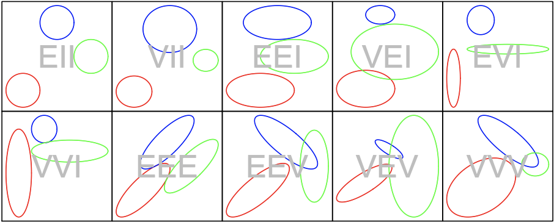
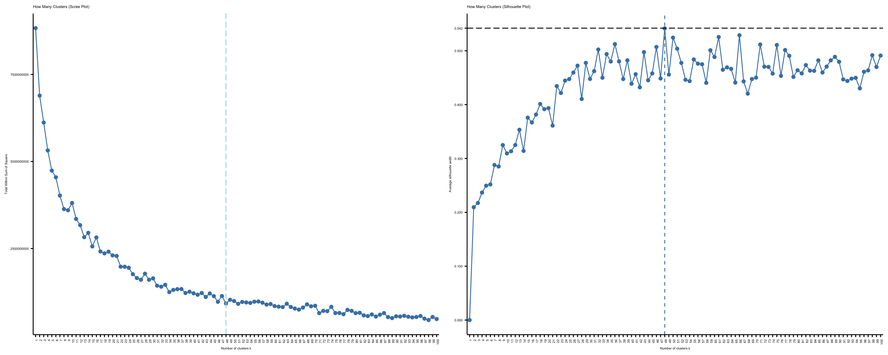
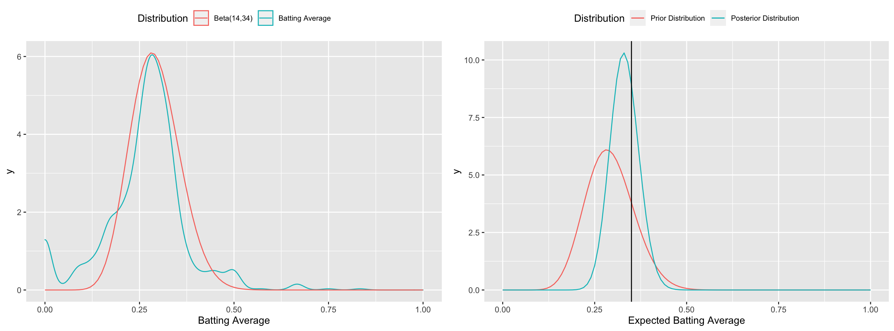

```{r global_options, include=FALSE}
knitr::opts_chunk$set(fig.pos = 'H')
```

```{r, setup = TRUE, include = FALSE}
# Do not delete this chunk
library(mosaic)
library(readr)
library(tidyr)
library(psych)
library(ggplot2)
library(factoextra)
library(cluster)
library(rpart)
library(DescTools)
library(GGally)
#devtools::install_github(repo = "BillPetti/baseballr")
library(baseballr)
library(ClusterR)
library(rpart.plot)
library(rattle)
library(parsnip)
library(rsample)
library(mclust)
library(latticeExtra)
library(vioplot)
library(ResourceSelection)
library(pscl)
library(kableExtra)
# Setting Rounding
options(digits = 6)
# Formatting
knitr::opts_chunk$set(
  echo = FALSE, warning = FALSE, message = FALSE, results = "hide", fig.width = 6,
  fig.height = 4, comment = NA, fig.show = "hide", dpi = 300
)
# For any tables
kable <- function(x, booktabs = TRUE, align = "c", format, digits = getOption("digits"), row.names = NA, col.names = NA, caption = NULL, label = NULL, format.args = list(), escape = TRUE, full_width = NULL, bootstrap_options = "basic", position = "center", latex_options = c("HOLD_position", "repeat_headers"), font_size = NULL, row_label_position = "l", ...) {
  knitr::kable(x, booktabs = booktabs, align = align, format = format, digits = digits, row.names = row.names, col.names = col.names, caption = caption, label = label, format.args = format.args, escape = escape, ...) %>%
    kableExtra::kable_styling(full_width = full_width, bootstrap_options = bootstrap_options, position = position, latex_options = latex_options, font_size = font_size, row_label_position = row_label_position, ...)
}
```

<!-- DATA READ IN -------------------------------------------------------------------------------->

```{r}
# All Data From Wrangle.Rmd

load("data/allPitches.rda")
load("data/final_pitcher_data.rda")
load("data/ID_lookup.rda")
load("data/leader_BA.rda")
load("data/leader_BA_Pit.rda")
```

<!-- HELPER FUNCTIONS -------------------------------------------------------------------------------->

```{r, echo=FALSE}
# A Function meant to describe the basics of each cluster
describeCluster <- function(cluster) {
  thisCluster <- clusterStats %>% filter(kmeans == cluster)
  thisClusterPlayers <- cluster_pitcher_data %>% filter(kmeans == cluster)
  frequentPitches <- c()
  occasionalPitches <- c()

  if (thisCluster$rate_sinker > .2) {
    frequentPitches[length(frequentPitches) + 1] <- "sinker"
  } else if (thisCluster$rate_sinker > 0) {
    occasionalPitches[length(occasionalPitches) + 1] <- "sinker"
  }

  if (thisCluster$rate_split_finger > .2) {
    frequentPitches[length(frequentPitches) + 1] <- "splitter"
  } else if (thisCluster$rate_split_finger > 0) {
    occasionalPitches[length(occasionalPitches) + 1] <- "splitter"
  }

  if (thisCluster$rate_4_changeup > .2) {
    frequentPitches[length(frequentPitches) + 1] <- "changeup"
  } else if (thisCluster$rate_4_changeup > 0) {
    occasionalPitches[length(occasionalPitches) + 1] <- "changeup"
  }

  if (thisCluster$rate_4_seam_fastball > .2) {
    frequentPitches[length(frequentPitches) + 1] <- "fastball"
  } else if (thisCluster$rate_4_seam_fastball > 0) {
    occasionalPitches[length(occasionalPitches) + 1] <- "fastball"
  }
  if (thisCluster$rate_2_seam_fastball > .2) {
    frequentPitches[length(frequentPitches) + 1] <- "2-seam"
  } else if (thisCluster$rate_2_seam_fastball > 0) {
    occasionalPitches[length(occasionalPitches) + 1] <- "2-seam"
  }
  if (thisCluster$rate_curveball > .2) {
    frequentPitches[length(frequentPitches) + 1] <- "curveball"
  } else if (thisCluster$rate_curveball > 0) {
    occasionalPitches[length(occasionalPitches) + 1] <- "curveball"
  }
  if (thisCluster$extension_knuckle_curve > .2) {
    frequentPitches[length(frequentPitches) + 1] <- "knuckle curve"
  } else if (thisCluster$extension_knuckle_curve > 0) {
    occasionalPitches[length(occasionalPitches) + 1] <- "knuckle curve"
  }
  if (thisCluster$rate_slider > .2) {
    frequentPitches[length(frequentPitches) + 1] <- "slider"
  } else if (thisCluster$rate_slider > 0) {
    occasionalPitches[length(occasionalPitches) + 1] <- "slider"
  }
  if (thisCluster$rate_cutter > .2) {
    frequentPitches[length(frequentPitches) + 1] <- "cutter"
  } else if (thisCluster$rate_cutter > 0) {
    occasionalPitches[length(occasionalPitches) + 1] <- "cutter"
  }

  thisClusterLefties <- thisClusterPlayers %>% filter(thisClusterPlayers$extension_2_seam_fastball >= 0 & thisClusterPlayers$extension_4_seam_fastball >= 0 & thisClusterPlayers$extension_changeup >= 0 & thisClusterPlayers$extension_slider >= 0 & thisClusterPlayers$extension_sinker >= 0 & thisClusterPlayers$extension_knuckle_curve >= 0 & thisClusterPlayers$extension_curveball >= 0 & thisClusterPlayers$extension_cutter >= 0 & thisClusterPlayers$extension_split_finger >= 0)

  lefties <- nrow(thisClusterLefties)
  righties <- nrow(thisClusterPlayers) - lefties


  cat(paste("\n", "This Cluster has", nrow(thisClusterPlayers), "pitchers (", righties, "Righties and", lefties, "Lefties )"))

  cat(paste("\n", "Frequent Pitches of Cluster", cluster, ": "))
  cat(frequentPitches)
  cat(paste("\n", "Occasional Pitches of Cluster", cluster, ": "))
  cat(occasionalPitches)
}
```

```{r, echo=FALSE}
# A Function meant to describe the basics of each mixture

describeMixture <- function(cluster) {
  thisCluster <- mixtureStats %>% filter(mixture == cluster)
  thisClusterPlayers <- cluster_pitcher_data %>% filter(mixture == cluster)

  frequentPitches <- c()
  occasionalPitches <- c()

  if (thisCluster$rate_sinker > .2) {
    frequentPitches[length(frequentPitches) + 1] <- "sinker"
  } else if (thisCluster$rate_sinker > 0) {
    occasionalPitches[length(occasionalPitches) + 1] <- "sinker"
  }

  if (thisCluster$rate_split_finger > .2) {
    frequentPitches[length(frequentPitches) + 1] <- "splitter"
  } else if (thisCluster$rate_split_finger > 0) {
    occasionalPitches[length(occasionalPitches) + 1] <- "splitter"
  }

  if (thisCluster$rate_4_changeup > .2) {
    frequentPitches[length(frequentPitches) + 1] <- "changeup"
  } else if (thisCluster$rate_4_changeup > 0) {
    occasionalPitches[length(occasionalPitches) + 1] <- "changeup"
  }

  if (thisCluster$rate_4_seam_fastball > .2) {
    frequentPitches[length(frequentPitches) + 1] <- "fastball"
  } else if (thisCluster$rate_4_seam_fastball > 0) {
    occasionalPitches[length(occasionalPitches) + 1] <- "fastball"
  }
  if (thisCluster$rate_2_seam_fastball > .2) {
    frequentPitches[length(frequentPitches) + 1] <- "2-seam"
  } else if (thisCluster$rate_2_seam_fastball > 0) {
    occasionalPitches[length(occasionalPitches) + 1] <- "2-seam"
  }
  if (thisCluster$rate_curveball > .2) {
    frequentPitches[length(frequentPitches) + 1] <- "curveball"
  } else if (thisCluster$rate_curveball > 0) {
    occasionalPitches[length(occasionalPitches) + 1] <- "curveball"
  }
  if (thisCluster$extension_knuckle_curve > .2) {
    frequentPitches[length(frequentPitches) + 1] <- "knuckle curve"
  } else if (thisCluster$extension_knuckle_curve > 0) {
    occasionalPitches[length(occasionalPitches) + 1] <- "knuckle curve"
  }
  if (thisCluster$rate_slider > .2) {
    frequentPitches[length(frequentPitches) + 1] <- "slider"
  } else if (thisCluster$rate_slider > 0) {
    occasionalPitches[length(occasionalPitches) + 1] <- "slider"
  }
  if (thisCluster$rate_cutter > .2) {
    frequentPitches[length(frequentPitches) + 1] <- "cutter"
  } else if (thisCluster$rate_cutter > 0) {
    occasionalPitches[length(occasionalPitches) + 1] <- "cutter"
  }

  thisClusterLefties <- thisClusterPlayers %>% filter(thisClusterPlayers$extension_2_seam_fastball >= 0 & thisClusterPlayers$extension_4_seam_fastball >= 0 & thisClusterPlayers$extension_changeup >= 0 & thisClusterPlayers$extension_slider >= 0 & thisClusterPlayers$extension_sinker >= 0 & thisClusterPlayers$extension_knuckle_curve >= 0 & thisClusterPlayers$extension_curveball >= 0 & thisClusterPlayers$extension_cutter >= 0 & thisClusterPlayers$extension_split_finger >= 0)

  lefties <- nrow(thisClusterLefties)
  righties <- nrow(thisClusterPlayers) - lefties


  cat(paste("\n", "This Mixture has", nrow(thisClusterPlayers), "pitchers (", righties, "Righties and", lefties, "Lefties )"))
  cat(paste("\n", "Frequent Pitches of Mixture", cluster, ": "))
  cat(frequentPitches)
  cat(paste("\n", "Occasional Pitches of Mixture", cluster, ": "))
  cat(occasionalPitches)
}
```

```{r, echo=FALSE}
# Give a pitcher name and get the other pitchers in the cluster/mixture

get_other_pitcherskmeans <- function(pitcherName, data = cluster_pitcher_data) {
  justPitcherCluster <- (data %>% filter(name == pitcherName))$kmeans
  cat(paste("Cluster: ", justPitcherCluster, "\n"))

  otherPitchers <- (data %>% filter(kmeans == justPitcherCluster) %>%
    arrange(name))$name

  return(otherPitchers)
}

get_other_pitchersMix <- function(pitcherName, data = cluster_pitcher_data) {
  justPitcherCluster <- (data %>% filter(name == pitcherName))$mixture
  cat(paste("Mixture: ", justPitcherCluster, "\n"))

  otherPitchers <- (data %>% filter(mixture == justPitcherCluster) %>%
    arrange(name))$name

  return(otherPitchers)
}
```

```{r, echo=FALSE}
# Round numbers in a dataframe

round_df <- function(x, digits) {
  # round all numeric variables
  # x: data frame
  # digits: number of digits to round
  numeric_columns <- sapply(x, mode) == "numeric"
  x[numeric_columns] <- round(x[numeric_columns], digits)
  x
}
```

```{r, echo=FALSE}
# Get all the pitchers given a cluster name
getClusterPitchers <- function(cluster, data = cluster_pitcher_data) {
  return((data %>% filter(kmeans == cluster))$name)
}

getMixturePitchers <- function(cluster, data = cluster_pitcher_data) {
  return((data %>% filter(mixture == cluster))$name)
}
```

<!-- CLUSTERING -------------------------------------------------------------------------------->

```{r}
# Creating plots to measure the number of clusters we should use.

# Scree Plot
kClust <- fviz_nbclust(as.data.frame(final_pitcher_data %>% select(2:37)), kmeans, method = "wss", k.max = 100) +
  ggtitle("How Many Clusters (Scree Plot)") +
  theme(
    text = element_text(size = 4),
    axis.text.x = element_text(angle = 90, hjust = 1)
  )

# Silhouette plot
kSil <- fviz_nbclust(final_pitcher_data[c(2:37)], kmeans,
  method = "silhouette",
  k.max = 100
) +
  ggtitle("How Many Clusters (Silhouette Plot)") +
  theme(
    text = element_text(size = 4),
    axis.text.x = element_text(angle = 90, hjust = 1)
  )
```

```{r}
# Using kmeans method to Create my clusters
set.seed(123)
kms <- kmeans(final_pitcher_data[c(2:37)], 48, nstart = 25)
kmeans <- kms$cluster

kmeansCount <- as.data.frame(kmeans) %>%
  group_by(kmeans) %>%
  summarise(count = n())
```

<!-- MIXTURE -------------------------------------------------------------------------------->

```{r}
# Creating Mixture Model with 38 groups using EEI method.

mixtureMod <- Mclust(final_pitcher_data, G = 38, modelNames = "EEI")
percentages <- round_df(as.data.frame(mixtureMod[14]), 3)
mixtureClusters <- as.data.frame(mixtureMod[15]) %>%
  rename("mixture" = "classification")
```


```{r}
# Extra Wrangling to create plots of cluster sizes
cluster_pitcher_data_no_name <- cbind(final_pitcher_data, kmeans, mixtureClusters)
cluster_pitcher_data <- cbind(left_join(cluster_pitcher_data_no_name,
  ID_lookup,
  by = c("pitcher" = "key_mlbam")
))

kmeanGG <- ggplot(data = cluster_pitcher_data, aes(x = kmeans)) +
  geom_histogram(binwidth = 5) +
  xlim(0, 100) +
  xlab("Kmeans Cluster Sizes") +
  ylim(0, 250)
mixGG <- ggplot(data = cluster_pitcher_data, aes(x = mixture)) +
  geom_histogram(binwidth = 5) +
  xlim(0, 100) +
  xlab("Mixture Model Cluster Sizes") +
  ylim(0, 250)
cowplot::plot_grid(kmeanGG, mixGG)
```

```{r}
# Making a decision tree to explain my k-means clustering

whichclassKm <- decision_tree(mode = "classification") %>%
  set_engine("rpart", control = rpart.control(cp = 0.005, minbucket = 30)) %>%
  fit(as.factor(kmeans) ~ ., data = cluster_pitcher_data %>%
    select(-pitcher, -name, -mixture))

whichclassKm$fit$call <- rlang::call2("rpar::rpart", data = expr(sim_data))
kmTree <- prp(whichclassKm$fit)

# rattle::fancyRpartPlot(whichclass$fit)
```

```{r}

# Making a decision tree to explain my mixture groupings

whichclassMix <- decision_tree(mode = "classification") %>%
  set_engine("rpart", control = rpart.control(cp = 0.005, minbucket = 30)) %>%
  fit(as.factor(mixture) ~ ., data = cluster_pitcher_data %>%
    select(-pitcher, -name, -kmeans))

whichclassMix$fit$call <- rlang::call2("rpar::rpart", data = expr(sim_data))
mixTree <- prp(whichclassMix$fit)


# rattle::fancyRpartPlot(whichclass$fit)
```

```{r}
# Getting average stats of each cluster and mixture, while not including 0's in the mean calculation.

clusterStats2 <- cluster_pitcher_data %>%
  select(2:27, 38) %>%
  group_by(kmeans) %>%
  summarise_each(funs(mean(.[!is.na(.) & . != 0])))

clusterStats3 <- cluster_pitcher_data %>%
  select(28:38) %>%
  group_by(kmeans) %>%
  summarise(across(everything(), mean), number_of_pitchers = n())

clusterStats <- left_join(clusterStats2, clusterStats3)
clusterStats[is.na(clusterStats)] <- 0

mixtureStats2 <- cluster_pitcher_data %>%
  select(2:27, 39) %>%
  group_by(mixture) %>%
  summarise_each(funs(mean(.[!is.na(.) & . != 0])))

mixtureStats3 <- cluster_pitcher_data %>%
  select(28:37, 39) %>%
  group_by(mixture) %>%
  summarise(across(everything(), mean), number_of_pitchers = n())

mixtureStats <- left_join(mixtureStats2, mixtureStats3)
mixtureStats[is.na(mixtureStats)] <- 0
```

<!-- ANALYSIS -------------------------------------------------------------------------------->

```{r}
# Testing some functions

get_other_pitcherskmeans("Jacob deGrom")
get_other_pitchersMix("Jacob deGrom")

describeCluster(25)
describeMixture(11)
```


```{r}
get_other_pitcherskmeans("Max Scherzer")
get_other_pitchersMix("Max Scherzer")

describeCluster(13)
describeMixture(14)

scherzerClust <- cluster_pitcher_data %>% filter(kmeans == 13)
scherzerMix <- cluster_pitcher_data %>% filter(mixture == 14)

nrow(inner_join(as.data.frame(scherzerClust$name), as.data.frame(scherzerMix$name), by = c("scherzerClust$name" = "scherzerMix$name")))
```

```{r}
# Getting descriptions of each mixture and cluster

cluster <- 1
while (cluster <= 48) {
  cat(paste("\n", "K-Means Cluster to test:", cluster))
  describeCluster(cluster)
  if (cluster == 39) {
    cat("\n Only K-Means Solutions Remaining")
  }
  if (cluster <= 38) {
    cat(paste("\n", "Mixture to test:", cluster))

    describeMixture(cluster)
  }
  cluster <- cluster + 1
}
```

```{r}

# Getting season-long statistics for each player

leader_BA <- leader_BA %>%
  select(first_name, last_name, year, player_id, ba, pa)
combinedData <- left_join(all_pitches, leader_BA,
  by = c("batter" = "player_id", "year" = "year")
)

## rm(all_pitches)

leader_BA_Pit <- leader_BA %>%
  select(first_name, last_name, year, player_id, ba, pa)

combinedData2 <- left_join(combinedData, leader_BA_Pit,
  by = c("pitcher" = "player_id", "year" = "year")
)
## rm(combinedData)

leader_with_cluster <- left_join(combinedData2, cluster_pitcher_data) %>%
  filter(!is.na(kmeans)) %>%
  filter(Result == "double" | Result == "triple" | Result == "home run" |
    Result == "out" | Result == "single") %>%
  mutate(isHit = ifelse(Result == "out", 0, 1))

## rm(combinedData2)
```

```{r}
# A Method to find pitchers who might belong to multiple mixtures.

# percentagesTest <- cbind(final_pitcher_data, percentages) %>% select(1, 38:75)
# percentagesPivotLong <- pivot_longer(percentagesTest, cols = 2:39)

# mixture_hold <- left_join(leader_with_cluster, percentagesTest) %>%
#   select(pitcher, batter, isHit, 56:93)
#
# mixture_conflict <- mixture_hold %>%
#     filter(z.1 < .95 & z.1 > 0.05 | z.2 < .95 & z.2 > 0.05 |
#            z.3 < .95 & z.3 > 0.05 | z.4 < .95 & z.4 > 0.05 |
#            z.5 < .95 & z.5 > 0.05 | z.6 < .95 & z.6 > 0.05 |
#            z.7 < .95 & z.7 > 0.05 | z.8 < .95 & z.8 > 0.05 |
#            z.9 < .95 & z.9 > 0.05 | z.10 < .95 & z.10 > 0.05 |
#            z.11 < .95 & z.11 > 0.05 | z.12 < .95 & z.12 > 0.05 |
#            z.13 < .95 & z.13 > 0.05 | z.14 < .95 & z.14 > 0.05 |
#            z.15 < .95 & z.15 > 0.05 | z.16 < .95 & z.16 > 0.05 |
#            z.17 < .95 & z.10 > 0.05 | z.18 < .95 & z.18 > 0.05 |
#            z.19 < .95 & z.19 > 0.05 | z.20 < .95 & z.20 > 0.05 |
#            z.21 < .95 & z.21 > 0.05 | z.22 < .95 & z.22 > 0.05 |
#            z.23 < .95 & z.23 > 0.05 | z.24 < .95 & z.24 > 0.05 |
#            z.25 < .95 & z.25 > 0.05 | z.26 < .95 & z.26 > 0.05 |
#            z.27 < .95 & z.27 > 0.05 | z.28 < .95 & z.28 > 0.05 |
#            z.29 < .95 & z.29 > 0.05 | z.30 < .95 & z.30 > 0.05 |
#            z.31 < .95 & z.31 > 0.05 | z.32 < .95 & z.32 > 0.05 |
#            z.33 < .95 & z.33 > 0.05 | z.34 < .95 & z.34 > 0.05 |
#            z.35 < .95 & z.35 > 0.05 | z.36 < .95 & z.36 > 0.05 |
#            z.37 < .95 & z.37 > 0.05 | z.38 < .95 & z.38 > 0.05)
#
# mixture_conflictPivot <- pivot_longer(mixture_conflict, cols = 4:41) %>%
#   filter(value > .05 & value < .95)
#
# table(mixture_conflictPivot$name)
#
# mixture_conflictPivotWider <- left_join(pivot_wider(mixture_conflictPivot,
#                                                     names_from = name,
#                                                     values_from = value) %>%
#                                           mutate(z.5 = z.5[1]), ID_lookup,
#                                         by = c("pitcher" = "key_mlbam"))
#
# table(mixture_conflictPivotWider$pitcher)
#
# mixturePivot <- pivot_longer(mixture_hold, cols = 4:41)
#
# head(mixturePivot)
#
#
# mixtureSum <- mixturePivot %>%
#   group_by(pitcher) %>%
#   summarise(mixABs = sum(value), mixHits = sum(isHit * value))
# Notes.
#
# 6 Pitchers with less than 95% chance of belonging to one cluster or a 5% greater chance of belonging to other
#
# Problem pitchers:   Casey Janssen   Chris Withrow    Emilio Pagan Jordan Yamamoto       Ryan Burr    Ryan Helsley
# Case Study
# mixtureStats %>% filter(mixture == 32 | mixture == 5 | mixture == 10)
#
# cluster_pitcher_data %>%
#              filter(pitcher == 445163 | pitcher == 519437 | pitcher == 621114
#                     | pitcher == 641941 | pitcher == 657141 | pitcher == 664854)
```

```{r}
# Looking at mixtures that have players that may belong to multiple mixtures

describeMixture(32)
describeMixture(5)
describeMixture(10)
```

```{r}
# More wrangling to combine different data frames

groupBatterPitcher <- leader_with_cluster %>%
  group_by(pitcher, batter) %>%
  summarise(P_AB = n())
groupBatterPitcherHits <- leader_with_cluster %>%
  group_by(batter, pitcher) %>%
  summarise(P_Hits = sum(isHit))


pitcherCombo <- inner_join(groupBatterPitcherHits, groupBatterPitcher)

all_info <- inner_join(leader_with_cluster, pitcherCombo)
# rm(leader_with_cluster)
# rm(pitcherCombo)


groupBatterCluster <- all_info %>%
  group_by(batter, kmeans) %>%
  summarise(C_AB = n())

groupBatterMixture <- all_info %>%
  group_by(batter, mixture) %>%
  summarise(mix_AB = n())

groupBatterClusterHits <- all_info %>%
  group_by(batter, kmeans) %>%
  summarise(C_Hits = sum(isHit))
groupBatterMixtureHits <- all_info %>%
  group_by(batter, mixture) %>%
  summarise(mix_Hits = sum(isHit))

clusterCombo <- full_join(groupBatterClusterHits, groupBatterCluster)
mixCombo <- full_join(groupBatterMixture, groupBatterMixtureHits)

all_info_cluster <- inner_join(inner_join(all_info, clusterCombo), mixCombo)
# rm(all_info)
# rm(clusterCombo)
# rm(mixCombo)
```

<!-- PREPPING DATA FOR MODELING ------------------------------------------------------------------>

```{r}
# Filtering out players with tiny sample sizes

filteredData <- all_info_cluster %>%
  filter(P_AB > 5 & C_AB > 5 & mix_AB > 5 & pa.x > 30 & pa.y > 30 & ba.x > 0 & ba.y > 0) %>%
  drop_na()

getBAData <- filteredData %>%
  group_by(batter) %>%
  summarise(hits = sum(isHit), AB = n()) %>%
  mutate(BA = hits / AB)
```

```{r}

# Finding proper prior distribution

quantile(getBAData$BA)


plot1 <- plotDist("beta",
  params = (c(12, 31)),
  xlim = c(0, 1), lwd = 2, col = "black", main = "Beta (12,31)"
)

cowplot::plot_grid(plot1, plot(density(getBAData$BA, bw = .05), xlim = c(0, 1), lwd = 2, xlab = "", main = "Batting Average Data"))

options(scipen = 100)
```

<!-- MODELLING  -------------------------------------------------------------------------------->

```{r}
# Editing data so it doesn't know the result of this AB when modeling.

# Ex: If a player was 5/9 including this at-bat they would be 4/8 if they got a hit in that at-bat or 5/8 if they didn't

filteredData <- filteredData %>%
  mutate(P_AB = P_AB - 1) %>%
  mutate(C_AB = C_AB - 1) %>%
  mutate(mix_AB = mix_AB - 1) %>%
  mutate(P_Hits = P_Hits - isHit) %>%
  mutate(C_Hits = C_Hits - isHit) %>%
  mutate(mix_Hits = mix_Hits - isHit) %>%
  mutate(batterAVG = (ba.x * pa.x - isHit) / (pa.x - 1)) %>%
  mutate(pitcherAVG = (ba.y * pa.y - isHit) / (pa.y - 1))

filteredData <- filteredData %>%
  mutate(P_AVG = P_Hits / P_AB) %>%
  mutate(C_AVG = C_Hits / C_AB) %>%
  mutate(mix_AVG = mix_Hits / mix_AB)

filteredData <- filteredData %>%
  mutate(P_beta = qbeta(.5, 14 + P_Hits, P_AB + 34 - P_Hits)) %>%
  mutate(C_beta = qbeta(.5, 14 + C_Hits, C_AB + 34 - C_Hits)) %>%
  mutate(mix_beta = qbeta(.5, 14 + mix_Hits, mix_AB + 34 - mix_Hits))
```

```{r}
# Splitting training and testing data
set.seed(100)
filteredData_parts <- filteredData %>%
  initial_split(prop = 0.8)
train <- filteredData_parts %>% training()
test <- filteredData_parts %>% testing()
```

```{r}
# Creating the different models
cor(train$P_beta, train$pitcherAVG)
glimpse(train)

simpleMod <- glm(isHit ~ batterAVG + pitcherAVG,
  data = train, family = "binomial"
)
summary(simpleMod)
pitcherMod <- glm(isHit ~ batterAVG + pitcherAVG + P_beta,
  data = train, family = "binomial"
)

summary(pitcherMod)
clusterMod <- glm(isHit ~ batterAVG + pitcherAVG + C_beta,
  data = train, family = "binomial"
)
summary(clusterMod)
mixMod <- glm(isHit ~ batterAVG + pitcherAVG + mix_beta,
  data = train, family = "binomial"
)
summary(mixMod)
bothMod <- glm(isHit ~ batterAVG + pitcherAVG + C_beta + mix_beta + P_beta,
  data = train, family = "binomial"
)
summary(bothMod)
```

```{r}
# Testing ANOVA on each model compared to simple model
anova(simpleMod, pitcherMod, test = "LR")
anova(simpleMod, clusterMod, test = "LR")
anova(simpleMod, mixMod, test = "LR")
```

```{r}
# Looking at deviance

logistic.model.list <- list(pitch = pitcherMod, clust = clusterMod, mix = mixMod)
# lapply(logistic.model.list, summary)
sapply(logistic.model.list, deviance)
```

```{r}
# Looking at the dataset using different tests

pR2(pitcherMod)
pR2(clusterMod)
pR2(mixMod)

hoslem.test(x = train$isHit, y = fitted(pitcherMod), g = 100)
hoslem.test(x = train$isHit, y = fitted(clusterMod), g = 100)
hoslem.test(x = train$isHit, y = fitted(mixMod), g = 100)

caret::varImp(bothMod)
```

```{r, warning=FALSE}
# Adding predicted data to each training/testing dataset

train_predicted_data <- train %>%
  mutate(isHitP = predict(pitcherMod, train, type = "response")) %>%
  mutate(isHitC = predict(clusterMod, train, type = "response")) %>%
  mutate(isHitMix = predict(mixMod, train, type = "response")) %>%
  mutate(isHitSimple = predict(simpleMod, train, type = "response")) %>%
  mutate(isHitBoth = predict(bothMod, train, type = "response"))

test_predicted_data <- test %>%
  mutate(isHitP = predict(pitcherMod, test, type = "response")) %>%
  mutate(isHitC = predict(clusterMod, test, type = "response")) %>%
  mutate(isHitMix = predict(mixMod, test, type = "response")) %>%
  mutate(isHitSimple = predict(simpleMod, test, type = "response")) %>%
  mutate(isHitBoth = predict(bothMod, test, type = "response")) %>%
  select(player_name, 52:74)
```

```{r}
# Checking results on testing data
sum(test_predicted_data$isHit)
sum(test_predicted_data$isHitMix)
sum(test_predicted_data$isHitC)
sum(test_predicted_data$isHitP)

sum(test_predicted_data$mix_beta)
sum(test_predicted_data$P_beta)
sum(test_predicted_data$C_beta)

justPreds <- test_predicted_data %>%
  select(isHit, isHitMix, isHitC, isHitP, isHitSimple)

justBeta <- test_predicted_data %>%
  select(isHit, P_beta, C_beta, mix_beta)

set.seed(1)
GGally::ggpairs(sample(justPreds, 10000) %>% select(-orig.id))
GGally::ggpairs(sample(justBeta, 10000) %>% select(-orig.id))
```

```{r}
# Showing results in plot form
s <- ggplot(test_predicted_data, aes(x = isHitSimple, fill = as.factor(isHit))) +
  geom_density(alpha = .4) +
  xlim(.175, .4) +
  xlab("Predicted Batting Average Via Simple") +
  scale_color_discrete(labels = c("Out", "Hit")) +
  labs(color = "Actual Result")
c <- ggplot(test_predicted_data, aes(x = isHitC, fill = as.factor(isHit))) +
  geom_density(alpha = .4) +
  xlim(.175, .4) +
  xlab("Predicted Batting Average Via Clustering") +
  scale_color_discrete(labels = c("Out", "Hit")) +
  labs(color = "Actual Result") +
  scale_fill_discrete(name = "Result", labels = c("Out", "Hit"))
p <- ggplot(test_predicted_data, aes(x = isHitP, fill = as.factor(isHit))) +
  geom_density(alpha = .4) +
  xlim(.175, .4) +
  xlab("Predicted Batting Average Via Pitcher") +
  scale_color_discrete(labels = c("Out", "Hit")) +
  labs(color = "Actual Result") +
  scale_fill_discrete(name = "Result", labels = c("Out", "Hit"))
m <- ggplot(test_predicted_data, aes(x = isHitMix, fill = as.factor(isHit))) +
  geom_density(alpha = .4) +
  xlim(.175, .4) +
  xlab("Predicted Batting Average Via Mixture Models") +
  scale_color_discrete(labels = c("Out", "Hit")) +
  labs(color = "Actual Result") +
  scale_fill_discrete(name = "Result", labels = c("Out", "Hit"))

cowplot::plot_grid(c, p, m)

predData <- as.data.frame(rbind(
  describe(x = test_predicted_data$isHitP),
  describe(x = test_predicted_data$isHitC),
  describe(x = test_predicted_data$isHitMix)
)) %>% select(2:11)

row.names(predData) <- c("Pitcher Model", "Cluster Model", "Mixture Model")
predData %>% kable()
```

```{r}
# Setting to now show results
knitr::opts_chunk$set(
  echo = FALSE, warning = FALSE, message = FALSE, fig.width = 6,
  fig.height = 4, fig.align = "center", comment = NA, fig.show = TRUE, results = TRUE
)
```

\newpage

# Introduction

## Overview

In baseball, a pitcher throws a variety of pitch types towards a batter in an attempt to fool the batter into missing the pitch or inducing weak contact. The batter is trying to make solid contact with the ball to generate a hit. When teams can bunch their hits together, this will oftentimes lead to runs, which is how the game is scored. The mean batting average ($\frac{hits}{AB}$) in Major League Baseball is typically around .250 with a standard deviation of .027. For each pitch thrown, hundreds of data points are generated by high-speed cameras that gauge everything from the spin axis of the ball to the exact millimeter the ball is released from. The following statistics are used in the pitcher grouping:

**Pitch Rate**: The percentage of all pitches a pitcher throws of a given type. 

**Velocity**: The miles per hour of the ball at its release speed.

**Spin Rate**: Spin rate is a measure of how often a ball spins during the time (in rotations per minute) it is thrown to the plate. 

**Extension**: Extension is the distance from the center of the pitching rubber to where the pitcher releases the ball. For this data, I used the Pythagorean x, z distance ($\sqrt{x^2+z^2}$) although if the x-coordinate is negative, I kept that to represent the difference between righties and lefties. A negative extension represents a right-handed pitcher. 

## Model Overview

There are many ways to group multivariate data. In unsupervised learning, there are hundreds of different strategies to say that one observation in a dataset is similar to another.^[The term "observation" will refer to a pitcher, rather than an at-bat.] This study will compare two different methods: k-means clustering and finite mixture models.^[When the word "cluster" is used, it will be used to refer to the k-means algorithm, although mixture models can also be used for clustering. "Grouping" will be used to refer to both methods.] Using a baseball dataset, this study aims to group observations using the two methods and then compare the benefits that each model offers. Each algorithm will also be compared to a control group in which each observation is treated as its own group.

### Past Model Work

#### K-means

K-means clustering has a long history as the preeminent unsupervised learning technique to group together data. K-means takes an input "k" number of clusters and then assigns a random observation to each cluster. K-means then assigns each future observation to the cluster of which the centroid of the cluster is most similar to the observation. The centroid is the theoretical mean observation of a given cluster but does not necessarily exist within the dataset, although after initializing the clusters with k-observations, the centroid would be the initial point of each cluster. K-means measures the similarity between two points by using the sum of the squared Euclidian distances for each observation and each centroid and assigning the observation to the cluster that minimizes that distance. After each observation has been assigned to its initial cluster, the observations are tested again to see if an updated centroid is a better fit. This process repeats until no observation switches clusters. K-means provides a quick and dirty method that does a fairly accurate job of assigning clusters although it is not entirely optimal [@hartigan_wong_1979].

#### Mixture Models

Mixture models were initially used to identify separate groups of univariate data. A mixture model assumes that there is an underlying set of distributions that our data belongs to, and that each data point belongs to one of those distributions. A normal mixture model is the most common mixture model and assumes that each data point belongs to some unknown normal distribution. The mixture model works to find the best potential normal distributions and assigns that point to a given mixture. Unlike k-means, mixture models assign points to mixtures probabilistically, recognizing that each point may have a reasonable chance of belonging to multiple mixtures. An example of the utility of mixture models can be seen below. Mixture A is a set of 10,000 random observations generated from a normal distribution with a mean of 2 and a standard deviation of 1. Mixture B follows a normal distribution with a mean of 5 and a standard deviation of 2. It can be difficult to ascertain that there are two distinct distributions from the leftmost plot, but with overlapping density plots, it can be more clear. The overlap between the density plots can also help to show the need for probabilistic groupings. While many values can be safely assumed to be in one mixture or the other, other points could reasonably belong to either cluster as the values are inside the density plots of both mixtures [@mclachlan_peel_2000].

```{r, fig.height=3,fig.width=6.75, fig.cap= "Visualizing Mixture Models"}
set.seed(1)
a <- data.frame(value = rnorm(10000, mean = 2, sd = 1), Mixture = "A")
b <- data.frame(value = rnorm(10000, mean = 5, sd = 2), Mixture = "B")
c <- rbind(a, b)

cowplot::plot_grid(
  ggplot(c, aes(x = value)) +
    geom_histogram(aes(y = ..density..), colour = "black", fill = "black", alpha = .5) +
    geom_density(alpha = .2, fill = "black") +
    xlab("x") +
    ylim(0, .4),
  ggplot(c, aes(x = value, fill = Mixture)) +
    geom_histogram(aes(y = ..density..), colour = "black", fill = "black", alpha = .5) +
    geom_density(alpha = .2) +
    xlab("x") +
    ylim(0, .4)
)
```

With a known number of components, mixture models use an expectation-maximization algorithm to help identify potential parameters for the different distributions. The expectation-maximization works similarly to k-means by initially assigning samples of the data to "k" (a user input value) to k mixtures and then assuming that each remaining observation has a uniform likelihood of belonging to each mixture. Next, the probability of each remaining observation belonging to each mixture is found, using probability theory. Finally, each mixture's distribution is updated by maximizing the expected conditional log-likelihood with respect to the assumed distribution [@melnykov_maitra_2010]. For multivariate mixture modeling, the same principles apply as univariate mixture modeling, but use a covariance matrix for each observation for assumed distributions to define the relationship between variables [@nagode_fajdiga_2011]. The shapes of the models must also be defined in terms of the orientation of the eigenvectors of the mixtures. To simplify the problem, we can add constraints to the groupings that we look for in the covariance matrix, allowing us to look at fewer parameters to estimate and provide easier interpretations of the mixture outputs. The different parameters are the volume, shapes, and orientation of the mixtures. [@hennig_2011]. 

```{r, out.width="50%", fig.cap="Mixture Model Shapes"}

```

## Baseball Overview

An oft-heard refrain while watching a baseball game is that a batter hits a given pitcher well. Most of the time, this is a comment on a batter's history of success against that pitcher. With few exceptions, each batter only has small sample sizes against each pitcher they face, as each batter likely only faces a specific pitcher a few times each season if at all. Occasionally, over many years, a batter may face a pitcher many times. Over 2015-2019, the most common batter-pitcher at-bat was Lorenzo Cain versus Jose Quintana, as they had 71 plate appearances against each other. Lorenzo Cain had 2943 plate appearances over that span and Jose Quintana faced 3971 batters. Only 2.4% of Cain's plate appearances were against Quintana and 1.8% of Quintana's at-bats were against Cain. Even in the most common matchup in all of baseball, the sample size is quite small. Frequent batter-pitcher matchups are even rarer in the current 30-team era with more pitchers per game and more evenly distributed scheduling [@lindbergh_2021]. On average, for any given at-bat, the batter faced the pitcher just 2.25 times between 2015-2019, excluding that at-bat itself. The distribution of the at-bats against a pitcher can be seen below.

```{r, fig.height=2,fig.width=3.5, fig.cap="The Infrequency of Repeated Batter-Pitcher Matchups"}
allBP <- all_pitches %>%
  group_by(player_name, pitcher) %>%
  summarise(AB = n() - 1)
allBP <- left_join(allBP, ID_lookup, by = c("pitcher" = "key_mlbam"))

ggplot(allBP, aes(x = AB)) +
  geom_histogram(binwidth = 1) +
  xlab("At-Bats Between Batter and Pitcher")
```

```{r, eval=FALSE}
nrow(all_pitches %>% filter(player_name == "Cain, Lorenzo"))
nrow(all_pitches %>% filter(pitcher == 500779))

71 / 2943
71 / 3971

mean(allBP$AB)
```

In short, due to the small sample sizes, it can be difficult to make meaningful claims from just a batter's history against a given pitcher, such as that a batter hits a specific pitcher well. If we assume that the results of a series of at-bats follow a binomial distribution with true probability $p$, even if a batter is 4 for 9 against a pitcher, good for a .444 batting line, this does not indicate a strong skill against that pitcher. If the true expected batting average against that pitcher for this batter is .250, that batter will get 4 or more hits almost 17% of the time per 9 at-bats. Likewise, the batter will get no hits or just one hit over 30% of the time. The sample sizes are simply too small to make any claim of value for most situations. Therefore, this study aims to narrow the binomial test confidence interval by expanding our sample size, while also looking to balance the tradeoff between increasing sample sizes and decreasing the value of the information, as the greater our grouping sizes are (and thus the greater our sample sizes would be), the less similar each pitcher will be.
```{r, eval=FALSE}
1 - pbinom(3, 9, .25)
dbinom(0, 9, .25) + dbinom(1, 9, .25)
```
This study seeks to remedy this problem by increasing the sample sizes. Instead of looking at just a batter's history versus a given pitcher, this study looks at a batter's history against a given *type of* pitcher. While all pitchers are unique, some pitchers are more unique than others. From the way they [pitch](https://twitter.com/PitchingNinja/status/1436871406382354432), to the pitches they [throw](https://twitter.com/PitchingNinja/status/1458851989933240326), to how they [utilize](https://twitter.com/pitchingninja/status/1399927522549190659?lang=en) their various pitches, each pitcher's pitching style tells a story awash in data. This data can be utilized to group pitchers together. 

### Past Baseball Work

Numerous past studies have looked to measure the value of batter-pitcher matchup history. Renowned baseball statistician Tom Tango first looked at this in a 2006 study, finding that he could not conclude that batter-pitcher matchup history held any meaning in predicting future outcomes [@tango_lichtman_dolphin_2014]. Former FanGraphs writer and San Diego Padres analyst Dave Cameron took another approach to assess batter-pitcher history. He uses the example of the Mariners starting 41-year-old Raúl Ibañez in 2013 against  Yankees ace C.C. Sabathia. Ibañez had very good career numbers against Sabathia in 52 plate appearances, hence why the Mariners chose to play Ibañez that day, despite his normally not starting. As Cameron further breaks down Ibañez's history against Sabathia, he notes that much of Ibañez's success came in 2002 and 2003, and Ibañez was fairly mediocre against Sabathia in the years afterward. In 2002, Ibañez was in his prime as an above-average outfielder, whereas Sabathia was 21 years old, in his second year in the majors, and still learning how to pitch at a Major League level. While Ibañez undoubtedly had plenty of experience against Sabathia, the notion that Ibañez's history over ten years ago would be relevant against Sabathia in 2013, despite Ibañez's lack of recent success, demonstrates that even extensive batter-pitcher matchup histories oftentimes do not hold predictive merit [@cameron_2013].

# Methods

## Data Collection

The entirety of this data was scraped from [Baseball Savant](baseballsavant.mlb.com) using the `baseballR` package. The original dataset consisted of every pitch in the Major League Baseball regular season from 2015 to 2019. These years were chosen, as at the time of data collection these were all past full seasons with Statcast data available. Each pitcher who threw at least 100 pitches of each of their pitch types over the 5 seasons was included in the dataset. Due to small sample sizes, eephuses, knuckleballs, forkballs, and screwballs were not included, as no more than 4 total pitchers in the entire dataset threw any of those pitches. In the end, there were 1204 pitchers in the dataset. For modeling pitch outcomes, each at-bat from 2015-2019 was included. For modeling purposes, only at-bats in which both the hitter had more than 30 plate appearances and the pitcher had more than 30 batters faced, were kept. Using this methodology, 925,098 at-bats were kept. 

## Methods Overview

To best measure the validity of different grouping approaches, there are a series of steps to take. Firstly, the pitchers need to be separated into groups and the number of groups for each method must be determined. Ideally, the group count of both methods is relatively similar, so that comparisons can be more easily made and have similar values. Once the groupings are complete, comparable models must be created using the various groupings (control, k-means, mixture). Each model should account for the differences in sample sizes between players. A player who is 30/100 against a cluster or mixture versus 3/10 should have different weights, as the 3/10 player should have more shrinkage and regression to the mean, whereas the player who has hit 30/100 should more heavily weight that data. Finally, the models should be compared to test the strengths and weaknesses of each grouping algorithm.

## Preliminary Analysis of Dataset

To best understand the outputs, we should have some understanding of our data. The first thing to look at is the overall pitch rates in the dataset. The first column shows the rate of pitchers who throw each pitch. The second column shows the overall frequency of each pitch among all pitches in the dataset. The third column shows the mean frequency of each pitch, among all pitchers who throw that pitch. For example, 23.5% of pitchers throw a sinker, but only 10.7% of all pitches are sinkers. However, among the 23.5% of pitchers who throw a sinker, those pitchers throw 45.6% sinkers on average.  

```{r sample-table1}
#Means excluding 0
mean0 <- function(x) {
  return(mean(x[x > 0]))
}

means <- c(mean(final_pitcher_data$rate_2_seam_fastball), mean(final_pitcher_data$rate_4_changeup), mean(final_pitcher_data$rate_slider), mean(final_pitcher_data$rate_split_finger), mean(final_pitcher_data$rate_cutter), mean(final_pitcher_data$rate_curveball), mean(final_pitcher_data$rate_sinker), mean(final_pitcher_data$rate_knuckle_curve), mean(final_pitcher_data$rate_4_seam_fastball))

means0 <- c(mean0(final_pitcher_data$rate_2_seam_fastball), mean0(final_pitcher_data$rate_4_changeup), mean0(final_pitcher_data$rate_slider), mean0(final_pitcher_data$rate_split_finger), mean0(final_pitcher_data$rate_cutter), mean0(final_pitcher_data$rate_curveball), mean0(final_pitcher_data$rate_sinker), mean0(final_pitcher_data$rate_knuckle_curve), mean0(final_pitcher_data$rate_4_seam_fastball))

rates <- c(sum(final_pitcher_data$rate_2_seam_fastball> 0)/nrow(final_pitcher_data),
           sum(final_pitcher_data$rate_4_changeup> 0)/nrow(final_pitcher_data),
           sum(final_pitcher_data$rate_slider> 0)/nrow(final_pitcher_data),
           sum(final_pitcher_data$rate_split_finger> 0)/nrow(final_pitcher_data),
           sum(final_pitcher_data$rate_cutter> 0)/nrow(final_pitcher_data),
           sum(final_pitcher_data$rate_curveball> 0)/nrow(final_pitcher_data),
           sum(final_pitcher_data$rate_sinker> 0)/nrow(final_pitcher_data),
           sum(final_pitcher_data$rate_knuckle_curve> 0)/nrow(final_pitcher_data),
           sum(final_pitcher_data$rate_4_seam_fastball> 0)/nrow(final_pitcher_data))


pitches <- c("2-Seam FB", "Changeup", "Slider", "Splitter", "Cutter", "Curve", "Sinker", "Knuckle-Curve", "4-Seam FB")

df <- data.frame(pitches = pitches,rates = round(rates,3), mean = round(means,3),  mean0 = round(means0,3)) %>% arrange(by_group = pitches)

df%>%kable(col.names = c("Pitch Type", "% of Pitchers", "% of All Pitches", "% Pitches Among Pitchers"),caption = "Pitch Rates")%>%
      column_spec(1,width = "1.5in") %>%
      column_spec(2,width = "1.25in") %>%
      column_spec(3,width = "1.25in") %>%
      column_spec(4,width = "1.5in") 


# df <- df %>%
#   arrange(desc(pitches)) %>%
#   mutate(prop = means / sum(df$means) * 100) %>%
#   mutate(ypos = cumsum(prop) - 0.5 * prop)


# ggplot(df, aes(x = "", y = prop, fill = pitches)) +
#   geom_bar(stat = "identity", width = 1, color = "white") +
#   coord_polar("y", start = 0) +
#   theme_void() +
#   geom_text(aes(y = ypos, label = scales::percent(means)), color = "black", size = 2) +
#   scale_fill_brewer(palette = "Set1")

```
Digging further into the numbers, velocity is a key component of each pitch. Each pitch type is, on average, thrown at a  different speed. When looking at the barplot, the means are calculated by removing any pitcher who does not throw that specific pitch from the mean calculation; whereas in the violin plot, a pitcher who does not throw the pitch is calculated as a 0. 

```{r, fig.height=3, fig.width=4}
mean0 <- function(x) {
  return(mean(x[x > 0]))
}

means <- c(mean0(final_pitcher_data$release_speed_2_seam_fastball), mean0(final_pitcher_data$release_speed_changeup), mean0(final_pitcher_data$release_speed_slider), mean0(final_pitcher_data$release_speed_split_finger), mean0(final_pitcher_data$release_speed_cutter), mean0(final_pitcher_data$release_speed_curveball), mean0(final_pitcher_data$release_speed_sinker), mean0(final_pitcher_data$release_speed_knuckle_curve), mean0(final_pitcher_data$release_speed_4_seam_fastball))
pitches <- c("2-Seam FB", "Changeup", "Slider", "Splitter", "Cutter", "Curve", "Sinker", "Knuckle-Curve", "4-Seam FB")
df <- data.frame(means = means, pitches = pitches)

bar1 <- ggplot(df, aes(y = means, x = pitches, fill = pitches)) +
  geom_bar(stat = "identity") +
  ylab("Average Velocity (mph)") +
  xlab("Pitch Type") +
  theme(axis.text.x = element_text(angle = 90, vjust = 0.5, hjust = 1)) +
  scale_fill_brewer(palette = "Set1")

velos <- final_pitcher_data %>% select(2:10)

# Found it easier to format by saving graphs to images

# vioplot(velos,
#   names = c("2FB","4FB","CHU","SLD","SNK","KCV","CRV","CUT","SPL"),
#   col = "gold", las = 2
# )
```
```{r, echo=FALSE,out.width="49%",fig.show='hold',fig.align='center', fig.cap= "A Look At Velocities"}
knitr::include_graphics(c("otherObjects/bar1.png", "otherObjects/vioplot1.png"))
``` 

Next, we will analyze spin rates, which track how the ball moves through the air. Like the velocity plots, when looking at the barplot, the means are calculated by removing any pitcher who does not throw the pitch from the mean calculation; whereas in the violin plot, a pitcher who does not throw the pitch is calculated as a 0. 

```{r, fig.height=3, fig.width=4}
means <- c(mean0(final_pitcher_data$release_spin_rate_2_seam_fastball), mean0(final_pitcher_data$release_spin_rate_changeup), mean0(final_pitcher_data$release_spin_rate_slider), mean0(final_pitcher_data$release_spin_rate_split_finger), mean0(final_pitcher_data$release_spin_rate_cutter), mean0(final_pitcher_data$release_spin_rate_curveball), mean0(final_pitcher_data$release_spin_rate_sinker), mean0(final_pitcher_data$release_spin_rate_knuckle_curve), mean0(final_pitcher_data$release_spin_rate_4_seam_fastball))
pitches <- c("2-Seam FB", "Changeup", "Slider", "Splitter", "Cutter", "Curve", "Sinker", "Knuckle-Curve", "4-Seam FB")
df <- data.frame(means = means, pitches = pitches)


bar2 <- ggplot(df, aes(y = means, x = pitches, fill = pitches)) +
  geom_bar(stat = "identity") +
  ylab("Average Spin Rate (rpm)") +
  xlab("Pitch Type") +
  theme(axis.text.x = element_text(angle = 90, vjust = 0.5, hjust = 1)) +
  scale_fill_brewer(palette = "Set1")

spinRates <- final_pitcher_data %>% select(11:19)


# vio2 <- vioplot(spinRates,
#   names = c("2FB","4FB","CHU","SLD","SNK","KCV","CRV","CUT","SPL"),
#   col = "gold", las = 2)
```

```{r, echo=FALSE,out.width="49%",fig.show='hold',fig.align='center', fig.cap="A Look At Spin Rates"}
knitr::include_graphics(c("otherObjects/bar2.png", "otherObjects/vio2.png"))
``` 

The last, and potentially most tricky part of the dataset is the release extensions. In this dataset, extension is defined as the total Euclidian distance from the center of the mound in terms of vertical and horizontal height. Righthanders were programmed as negative extension. For pitchers who do not throw a specific pitch, their release point for that pitch is 0. 

```{r, fig.height=4, fig.width=6, fig.cap= "A Look At Release Extensions"}
extensions <- final_pitcher_data %>% select(20:28)
colnames(extensions) <- c("2FB", "4FB", "CHU", "SLD", "SNK", "KCV", "CRV", "CUT", "SPL")
GGally::ggpairs(extensions, upper = list(continuous = wrap("cor", size = 3)))
```

The distributions are relatively normal, with two caveats: firstly, much of the density is for players who do not throw the pitch (more density towards 0 indicates that the pitch is less common), and secondly, the distributions are bimodal due to the righties and lefties. If the extension data did not include 0, and did not adjust the data by handedness, then it would be fairly normal. This can be seen in this histogram; the low correlations are partially a product of pitchers who do not throw a pitch having an extension of 0, and the difference between righties and lefties.

```{r, fig.height=2.5, fig.width=4, fig.cap="Comparing Righties to Lefties"}
ggplot(final_pitcher_data %>% filter(extension_4_seam_fastball != 0), aes(x = extension_4_seam_fastball)) +
  geom_histogram(binwidth = .2) +
  xlab("Average Extension on 4-Seam Fastballs (ft)") +
  ggplot2::annotate(
    geom = "text", x = -4, y = 100, label = "Righty",
    color = "black", size = 5
  ) +
  ggplot2::annotate(
    geom = "text", x = 4, y = 100, label = "Lefty",
    color = "black", size = 5
  ) +
  scale_x_continuous(breaks = c(-8, -7, -6, -5, -4, -3, -2, -1, 0, 1, 2, 3, 4, 5, 6, 7, 8)) +
  ylab("Count")
```

## Cluster Models

Now that we have assessed the data, the k-means clusters must be created. To determine the number of clusters to use, we will look at a scree plot and silhouette plot, and choose the cluster count that best approximates our data. Testing for every potential size of clusters from 1 to 100, 48 was chosen as the best cluster size. In the silhouette plot, 48 was the cluster count that produced the best average silhouette width. Looking at the scree plot, 48 seems like a reasonable choice that can be said to be close to the "elbow" of the plot.

```{r, fig.height=3, fig.width=7.5, out.width="100%", fig.cap="How Many Clusters?"}

# cowplot::plot_grid(kClust + geom_vline(xintercept = 48, colour = "light blue", linetype = "longdash"), kSil + scale_y_continuous(breaks = c(0, .1, .2, .3, .4, .5, .542, .6)) + geom_hline(yintercept = .542, colour = "black", linetype = "longdash"))



```

Having now created the clusters, we employed a decision tree to help explain what is happening under the hood of the cluster generation, although the decision tree is only an approximate look at the clustering and does not fully account for every cluster nor perfectly classify every pitcher.

```{r, fig.cap= "K-Means Decision Tree"}
prp(whichclassKm$fit,varlen = 0,tweak = 1.2)

# mean(kmeansCount$count)

# ggplot(data = kmeansCount, aes(x=count)) +
#   geom_density() +
#   xlab("Number of Pitchers In Cluster")


# describeCluster(8)
# describeCluster(43)
# getClusterPitchers(43)

#clus4 <- cluster_pitcher_data %>% filter(kmeans == 43)
```

## Mixture Models

The same basic principles that are used in clustering apply to mixture model group creation. Like clustering, we want to test for some large number of potential mixture numbers and then select the mixture count that creates the strongest mixtures. To do this, we will use Bayes Information Criterion, looking for the lowest score [@mclachlan_peel_2000, 209]. Below is a plot showing the BIC scores for different potential mixture algorithms. As mentioned above, each potential option provides different constraints to the potential mixture model distributions. We will use *EEI* (equal volume, round shape, spherical covariance) as our mixture algorithm with 38 mixtures. 
```{r, results='hide',fig.keep='all', fig.cap="How Many Mixtures?"}
load("otherObjects/mixCluster.rda")
plot(hold)[1] + abline(v = 38)
```
Looking at the now-created mixtures, the mixtures seem mostly focused on handedness, before any other attribute. Using a decision tree once again, we can see that the mixture model quickly separates the righties who throw those pitches into their own groups. It seems like the biggest splits are whether the pitcher is a righty who throws changeups or a lefty who throws sliders. Almost all the splits look to use righty and lefty extensions, grouping the pitchers by handedness and pitch types. The groups average about 32 pitchers per mixture, with a maximum of 90 and a minimum of 4. 

```{r, fig.cap="Mixture Model Decision Tree"}
prp(whichclassMix$fit,varlen = 0,tweak = 1.2)

mixes <- as.data.frame(mixtureMod[15]) %>%
  group_by(classification) %>%
  summarise(count = n())
# ggplot(mixes, aes(x= count )) + geom_density() +
#  xlab("Number of Pitchers In Mixture")

# mean(mixes$count)
# describeMixture(5)
# getMixturePitchers(5)
# describeMixture(24)
# getMixturePitchers(24)
# describeMixture(36)
# getMixturePitchers(36)
#
# cluster_pitcher_data %>% filter(mixture==24) %>% select(3,12,21,31,38:40)%>%kable()
```

## Model Comparison

When comparing the two grouping algorithms, a few things stand out: firstly, the group sizes are far less neatly distributed for the k-means clustering algorithm than the mixture algorithm. Secondly, the k-means clustering algorithm relies far more on pitch types, rather than pitch handedness, focusing far more on the rates of individual pitches. From looking through each cluster and mixture, the vast majority of mixtures are entirely, or very close to entirely, right-handed or left-handed, whereas most clusters are a mix of both, although some clusters are more exclusively one or the other. 

```{r, fig.height=2.5, fig.cap = "A Look At Group Sizes"}
mixes2 <- mixes %>%
  mutate(Grouping = "Mixture") %>%
  rename("group" = "classification")
kmeansCount2 <- kmeansCount %>%
  mutate(Grouping = "Cluster") %>%
  rename("group" = "kmeans")
allCounts <- rbind(mixes2, kmeansCount2)

ggplot(allCounts, aes(x = count, fill = Grouping)) +
  geom_density(alpha = .5) +
  xlab("Number of Pitchers In Grouping")
```

## Results Preview

To test the strength of the grouping algorithms, a variety of methods will be used to compare three different inputs: batter versus pitcher history, batter versus cluster history, and batter versus mixture history. Mathematically, batter versus pitcher history could be considered the same as treating each observation as their own mixture or cluster and helps to serve as a baseline model against which to compare the other models. To help account for the differences in sample sizes, a beta-binomial distribution, using Bayesian inference, will be used to help produce a future expected batting average. A beta-binomial distribution uses a prior that a given value follows a beta distribution and then takes the outcome of a binomial situation to create a posterior distribution. More formally, the beta-binomial distribution shows that if $X \sim \operatorname{Beta}(\alpha, \beta)$, and we are given $Y \sim \operatorname{Bin}(n,p)$, then $X|Y \sim \operatorname{Beta}(\alpha +np, \beta+n(1-p))$. For predicting future batting averages, we will use a prior that $BA \sim \operatorname{Beta}(14, 34)$, which may seem to be an arbitrary choice (and it is), but the $\operatorname{Beta}(14, 34)$ distribution closely follows the batting average distribution of our dataset, as seen below for each batter in the dataset. It may seem like a $\operatorname{Beta}(14, 34)$ distribution produces too high of a median batting average, but the batting average of this dataset is much higher than the overall MLB, as only players who meet a minimum at-bat threshold are kept in the dataset, which dramatically increases the standard of batters. To give an example of how the distribution would play out in this scenario, the binomial information given would be a player's history against a pitcher, cluster, or mixture. Say a batter was 35/100 against a given pitcher's cluster. The posterior would now follow a $\operatorname{Beta}(14+35, 34+100-35)=\operatorname{Beta}(49,99)$ distribution. This example can be seen below on the right, with the black line showing the new information of a .350 batting average in 100 at-bats. 

```{r, fig.width=6.5, fig.height=2.5, out.width="99%", fig.cap="Bayesian Inference Using the Beta-Binomial Conjugate"}
a <- ggplot(getBAData, aes(x = BA)) +
  geom_density(aes(col = "red")) +
  stat_function(aes(col = "blue"), fun = dbeta, args = list(shape1 = 14, shape2 = 34)) +
  xlim(0, 1) +
  scale_color_discrete(name = "Distribution", labels = c("Beta(14,34)", "Batting Average")) +
  xlab("Batting Average") +
  theme(
    legend.position = "top",
    legend.text = element_text(size = 8)
  )


b <- ggplot() +
  stat_function(aes(col = "blue"), fun = dbeta, args = list(shape1 = 14, shape2 = 34)) +
  xlim(0, 1) +
  stat_function(aes(col = "red"), fun = dbeta, args = list(shape1 = 49, shape2 = 99)) +
  xlim(0, 1) +
  geom_vline(xintercept = .35) +
  scale_color_discrete(name = "Distribution", labels = c("Prior Distribution", "Posterior Distribution")) +
  xlab("Expected Batting Average") +
  theme(
    legend.position = "top",
    legend.text = element_text(size = 8)
  )

#cowplot::plot_grid(a, b)


```

To best understand the results, we will build three separate logistic regression models (using an 80-20 training-testing split), each meant to predict the outcome of an individual at-bat between a specific batter and pitcher. Each model will take in the pitcher's season batting average against (the batting average the pitcher allows to opposing hitters), the batter's season batting average, and the batter's history against the grouping method that the model is testing. For each of the different inputs, including the batting averages, the result of the plate appearance being modeled has been removed. From there, a variety of tests will be performed to compare the models. 

# Results

While there is no perfect way to compare logistic regression models, there are a variety of ways to use the models to compare the value of batter versus pitcher data, batter versus cluster data, and batter versus mixture data. The first method compares the three logistic regression models to a baseline model containing just knowledge about the batter's batting average and pitcher's batting average against. Using an ANOVA likelihood ratio test, we examine the value of each additional predictor to the baseline model. In this case, the additional predictor would be the mean of the posterior beta distribution from the pitcher, cluster, and mixture. All three additional inputs are statistically significant (P<.05) compared to the baseline model, although the deviances are different. The additional batter versus pitcher input has a deviance of 4.339 and a P-value of .0372. The additional batter versus cluster input has a deviance of 11.93 and a P-value of 0.000552. The additional batter versus mixture input has a deviance of 30.01 and a P-value of 4.29e-08. This indicates that we can be confident that each of the three inputs provides statistically significant value to the model, and the differences in deviance and p-values suggest that the mixture model provides the most additional value, followed by the cluster, and then pitcher. A pseudo-$R^2$ value for the three models shows the mixture model as the most predictive. Finally, a Hosmer and Lemeshow goodness of fit test for each of the three methods finds that the mixture model produces the best fit, followed by the cluster model, and then the pitcher-only model. 

This conclusion is confirmed by analyzing a model that has all three inputs, as well as the batter's batting average and pitcher's batting average against, and then looking at a variable importance metric of the various inputs into the model. The variable importance metrics find that the value of the batter-pitcher and batter-cluster variable is relatively negligible, whereas the value of the batter versus mixture history is quite high. This conclusion is supported by the z-scores in the model summary. The z-score of batter-pitcher is -0.05 (P-value: .96), batter-cluster is 0.74 (P-value: 0.46), and batter-mixture is 4.26 (P-value: 0.000021). In other words, when given access to information from all three models, a logistic regression model found that only the mixture model output was statistically significant. 
```{r, eval=FALSE}
options(scipen = 3)
anova(simpleMod, pitcherMod, test = "LR")
anova(simpleMod, clusterMod, test = "LR")
anova(simpleMod, mixMod, test = "LR")

summary(bothMod)
caret::varImp(bothMod)
```
```{r, fig.width=6.5, fig.height=2.5, fig.cap="Predictions By Grouping Method"}
c <- ggplot(test_predicted_data, aes(x = isHitC, fill = as.factor(isHit))) +
  geom_density(alpha = .4) +
  xlim(.175, .4) +
  xlab("Predicted Batting Average Via Clustering") +
  scale_color_discrete(labels = c("Out", "Hit")) +
  labs(color = "Actual Result") +
  scale_fill_discrete(name = "Result", labels = c("Out", "Hit")) +
  theme(title = element_text(size = 6, face = "bold")) +
  scale_x_continuous(breaks = c(.200, .300, .400))+
  theme(legend.position = "top") 

p <- ggplot(test_predicted_data, aes(x = isHitP, fill = as.factor(isHit))) +
  geom_density(alpha = .4) +
  xlim(.175, .4) +
  xlab("Predicted Batting Average Via Pitcher") +
  scale_color_discrete(labels = c("Out", "Hit")) +
  labs(color = "Actual Result") +
  scale_fill_discrete(name = "Result", labels = c("Out", "Hit")) +
  theme(title = element_text(size = 6, face = "bold")) +
  scale_x_continuous(breaks = c(.200, .300, .400))+
  theme(legend.position = "top") 

m <- ggplot(test_predicted_data, aes(x = isHitMix, fill = as.factor(isHit))) +
  geom_density(alpha = .4) +
  xlim(.175, .4) +
  xlab("Predicted Batting Average Via Mixture Models") +
  scale_color_discrete(labels = c("Out", "Hit")) +
  labs(color = "Actual Result") +
  scale_fill_discrete(name = "Result", labels = c("Out", "Hit")) +
  theme(title = element_text(size = 6, face = "bold")) +
  scale_x_continuous(breaks = c(.200, .300, .400))+
  theme(legend.position = "top") 

cowplot::plot_grid(p, c, m, align = "h", nrow = 1)
```
Finally, looking at the testing data can also provide a helpful method for comparing the various inputs. In the testing dataset, there were 7306 hits. Using just the posterior distribution from the batter-pitcher matchups, we would expect 7206 hits, from the batter-cluster matchups, we would expect 7267 hits, and from the batter-mixture matchups, we would expect 7261 hits. 
```{r, eval=FALSE}
sum(test_predicted_data$isHit)
sum(test_predicted_data$P_beta)
sum(test_predicted_data$C_beta)
sum(test_predicted_data$mix_beta)
```

# Discussion

The results of the study all point to one conclusion: that grouping pitchers together provides predictive value in projecting the outcomes of at-bats. Furthermore, this method proves that there is more value than using just batter-pitcher history and that, between methods, using mixture modeling is a more effective grouping method than k-means clustering, at least on this dataset. 

## Model Implications

The results of this study illuminate the differences in the strengths and weaknesses of mixture models versus clusters. Mixture models clearly outperformed cluster models and more closely matched the baseball intuition that handedness should be an important factor in grouping pitchers. Both models outperformed the baseline of treating every observation as their own individual group, which supports the notion that grouping via clustering and mixture models can improve sample size quality. As mentioned in the introduction, the mean at-bats between batter and pitcher in this dataset is 2.25, however, the mean at-bats between pitcher and cluster is 17.08 and the mean at-bats between pitcher and mixture is 20.96. The distributions can be seen below (note the different y-axis scales). 

```{r}
allBP <- all_info_cluster %>%
  group_by(player_name, pitcher) %>%
  summarise(AB = n() - 1)
#mean(allBP$AB)


bp <- ggplot(allBP, aes(x = AB)) +
  geom_histogram(binwidth = 1) +
  xlab("At-Bats Between Batter and Pitcher") + xlim(0,100) +
  theme(axis.title=element_text(size=6))

allBP <- all_info_cluster %>%
  group_by(player_name, kmeans) %>%
  summarise(AB = n() - 1)
#mean(allBP$AB)

bc <- ggplot(allBP, aes(x = AB)) +
  geom_histogram(binwidth = 1) +
  xlab("At-Bats Between Batter and Cluster")+ xlim(0,100)+ ylim(0,7500) +
  theme(axis.title=element_text(size=6))


allBP <- all_info_cluster %>%
  group_by(player_name, mixture) %>%
  summarise(AB = n() - 1)

#mean(allBP$AB)

bm <- ggplot(allBP, aes(x = AB)) +
  geom_histogram(binwidth = 1) +
  xlab("At-Bats Between Batter and Mixture") + xlim(0,100) + ylim(0,7500) +
  theme(axis.title=element_text(size=6))
```


```{r, fig.width=6.5, fig.height=2, fig.cap="Distribution of At-Bats between Batter and Group"}
cowplot::plot_grid(bp,bc,bm,nrow = 1)
```

### Future Work

While this data set produces mixtures in which almost every observation fits neatly into a specific group, one of the key strengths of the mixture models is the probabilistic nature of the groupings. While formulating the question for this study, one of the expected challenges was that past histories against a given mixture were going to need to be weighted by the likelihood of an observation belonging to each mixture. A future study with a dataset that produces less clear mixtures would provide another opportunity to test the strengths of mixture modeling versus k-means clustering, as k-means does not compute probabilistic groupings, and instead assigns each observation to the cluster of the closest centroid. 

### Limitations & Assumptions

There are a variety of limitations that should be mentioned for how this study can be extrapolated. First and foremost, while this study may have many theoretical implications, the study's findings can only fully be applied to this baseball dataset towards this baseball question. We cannot say that mixture models should always be preferred to k-means clustering when grouping observations. This study also relies upon certain assumptions made by the researchers, such as setting a minimum number of plate appearances in a season to be able to stay in the dataset, which could affect the outcomes of the grouping methods. 

The other major limitation is the lack of a clear test to compare non-nested logistic regression models. While there are many ways to test the fit of a logistic regression model or compare nested models, there is not a clear statistical method that definitively proves that one model is superior to another. Accordingly, this study relies on a variety of tests, each with its imperfections, to draw its conclusion. 

## Baseball Implications

The baseball implications of this study are extensive. Knowing a batter's history against a group of similar pitchers can help to make decisions from lineup construction to betting. If a manager is debating which batter to start when the first batter has good numbers against the pitcher and the second batter has good numbers against the entire pitcher’s “type,” this study would advocate for starting the second batter. Furthermore, the inverse of this example can also be true; if a manager is debating which reliever to call in, they could consider using the pitcher who belongs to the group that the batter has historically performed worst against. Similarly, if a gambler is looking for a team or player in daily fantasy, that historically has had good results against a pitcher's mixture, the findings of this study could provide an edge for the gambler. 

### Future Work

There are a variety of ways this study could be expanded. Firstly, having access to minor league data would dramatically improve the quality of the dataset. While there are 30 MLB teams, there were 206 minor league teams and 14 leagues below the MLB from 2015-2019. Having access to this dataset would exponentially increase the sample sizes in this dataset, add predictive value, and provide a large enough sample size to use an only forward-thinking dataset. 

Another extension is to test the same premise beyond just simple batting averages. While batting average is important, looking at more advanced statistics such as wOBA, wRC+, exit velocity, and more would either enhance or show the limitations of the study. Almost any statistic that is the result of a batter-pitcher matchup could be measured by the grouping method and could test the same premise. A simple extension could be to project on-base percentage, which, at a minimum, would allow us to use all plate appearances, not just at-bats. 

### Limitations & Assumptions

While this study has many benefits, there are also some clear limitations from a baseball perspective. Like the Raúl Ibañez example, pitchers are not always consistent over long periods. The data used was from over five years of data, and not all pitchers will remain the same, even over just a few years. Some pitchers will get injured and lose velocity, while other pitchers will learn a new pitch or change their repertoire. This study looks at the aggregate pitching distribution for a given pitcher, but there will be many situations where a pitcher looks very different in 2019 compared to 2015. As we continue to get more Statcast data, the best method would be to continue to expand our dataset, while more heavily weighting more recent information. Another potential limitation of this study is that the logistic regression models use season-long batting averages with a minimum plate appearance threshold; but at the low end of the plate appearance threshold, a player still might have a decent variation from their true talent level, meaning that some of the projections on the extremes of the dataset may produce particularly high or low projections compared to the true talent level of the player, although this would be consistent for all the model types and therefore not impact the comparison of the models. In other words, the projections from the model are probably not overly predictive on their own, but still provide a useful way of measuring the values of the grouping algorithms.  

This study also relies on a potentially problematic statistical quandary: that the models are trained using some datapoints in which the data uses information from the future to predict the past. While the data has been adjusted to not include the tested at-bat in history, a data point in the testing set may rely upon a batter being 4 for 9 against a pitcher or group, in which all of those at-bats take place after the data point in question. The data could be adjusted to be only forward-thinking so that each modeled at-bat only knows the history against the pitcher, but it would dramatically reduce the sample size. For two reasons, we decided to prioritize sample size: firstly, if we prove that the theory works, then it should still apply to future examples, even if there are not as many players with detailed histories against pitchers or groupings. Secondly, in an ideal world, this study would have more data, including minor league data, and then be entirely forward-thinking, but this study already uses the maximum public Statcast data fully available. 

## Conclusion

The findings of this study provide a compelling argument for the value of mixture models as a tool for clustering, particularly compared to a more traditional k-means model. From a baseball perspective, this study helps to show that saying a batter hits a *type of* pitcher well is far more predictive than arguing that a batter hits a specific pitcher well. This study also shows how an approach using a beta-binomial distribution and Bayesian inference can help to weight different sample sizes of batter outcomes. Overall, we hope that this study will provide an instructive and novel look at batter-pitcher matchups and provide more insight on potential grouping methods. 

\newpage 

# References
